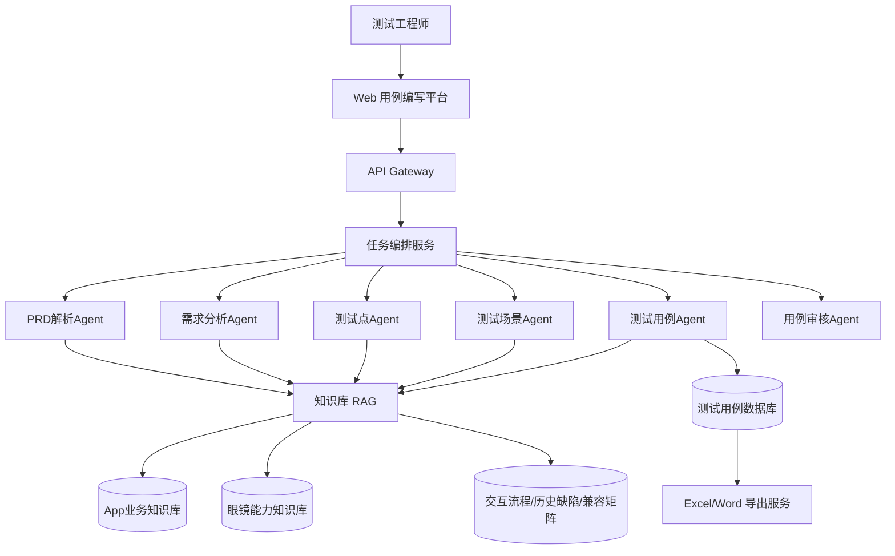
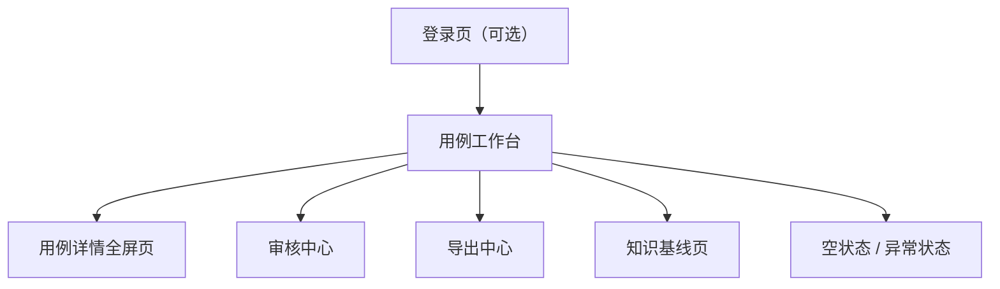
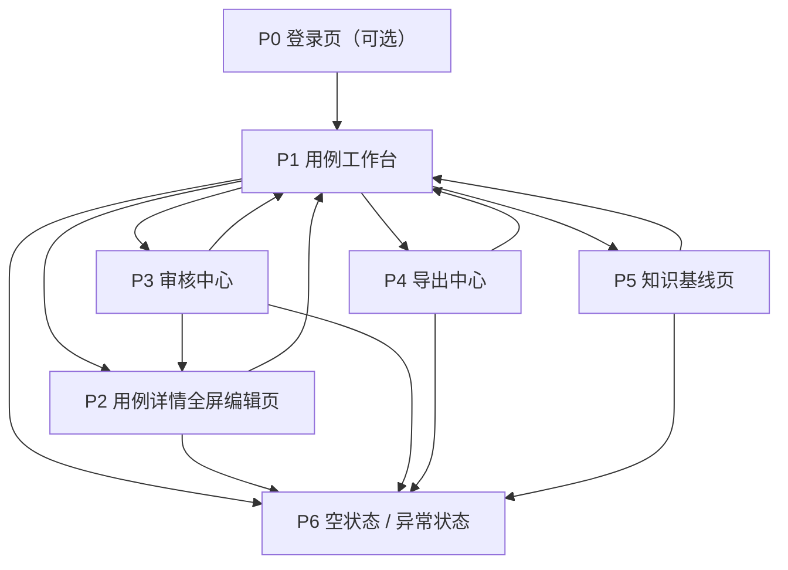

# 亿境测试部 UI Design PRD

## 1. 文档信息

- 项目名称：亿境测试部
- 文档类型：UI 设计 PRD
- 产品形态：Web 端测试用例编写平台
- 业务范围：手机 App、智能眼镜、双端联动
- 适用对象：UI 设计师、产品经理、前端开发
- 文档目的：为 UI 设计师提供完整的页面设计依据与交付边界
- 当前版本：V1.0

## 2. 项目背景

当前团队在测试用例编写阶段主要面临以下问题：

- 需求拆解口径不统一，手机端、眼镜端、双端联动场景容易遗漏
- 用例结构不稳定，不利于审核、导出和长期复用
- 编写、筛选、修改、审核分散在多个文档和表格中，效率低
- 缺少一套适合测试团队日常使用的统一 Web 工作台

本项目目标是建设一个聚焦“测试用例编写”的 Web 平台，用于承接需求输入、Agent 草案生成、人工修订、状态维护和导出准备。

## 3. 产品定位

### 3.1 产品定位

这是一个给测试团队使用的“测试用例编写工作台”，不是自动化执行平台，也不是设备管理平台。

### 3.2 核心价值

- 把零散需求整理成结构化测试用例
- 统一手机 App、智能眼镜、双端联动三类测试口径
- 提升编写效率、审核效率与导出效率
- 沉淀可复用的测试资产

### 3.3 非目标

- 不包含真机接入
- 不包含自动化执行调度
- 不包含缺陷跟踪系统
- 不包含复杂权限审批流
- 不包含多租户后台能力

## 4. 系统架构概览

当前产品在整体上采用“Web 平台 + Agent 编排 + RAG 知识库 + 用例沉淀”的模式。



### 4.1 架构说明

- `Web 用例编写平台` 是用户唯一直接操作入口
- `任务编排服务` 负责调度不同 Agent 完成需求拆解、场景生成、用例生成与审核
- `知识库 RAG` 为各 Agent 提供 App 业务、眼镜能力、交互流程和历史缺陷等知识支撑
- `测试用例数据库` 用于沉淀结构化用例资产
- `Excel/Word 导出服务` 用于输出可交付文档

### 4.2 对 UI 设计的影响

- UI 需要提供清晰的需求输入入口，方便触发 Agent 生成草案
- UI 需要承接 Agent 输出后的人工修改和审核
- UI 需要体现结构化字段和状态管理，而不是单纯文本编辑
- UI 需要为后续接入导出、审核和知识推荐预留模块空间

## 5. 用户角色

### 5.1 主要用户

- 测试工程师：编写、补充、整理、导出测试用例
- 测试负责人：审核范围覆盖、检查状态、导出结果

### 5.2 次要用户

- 产品经理：查看需求拆解后的测试覆盖情况
- 开发人员：查看联动测试口径和关键边界条件

### 5.3 角色差异

- 测试工程师更关注录入效率、编辑效率和结构完整性
- 测试负责人更关注状态分布、审核入口和导出质量
- 产品与开发更关注阅读效率和结构清晰度

## 6. 业务范围定义

平台中的测试用例统一分为以下三类：

### 6.1 手机 App

重点覆盖：

- 业务流程
- 权限申请
- 通知链路
- 前后台切换
- 网络切换

### 6.2 智能眼镜

重点覆盖：

- 语音交互
- 手势交互
- 提示态
- 佩戴态
- 低电量与设备边界

### 6.3 双端联动

重点覆盖：

- 配对
- 同步
- 断连重连
- 消息联动
- 状态一致性

## 7. 产品目标

### 7.1 核心目标

- 支持测试人员快速录入需求并生成结构化用例草案
- 支持按手机 App、智能眼镜、双端联动组织用例
- 支持在同一工作台内完成筛选、浏览、编辑和状态维护
- 支持后续接入 Excel / Word 导出能力

### 7.2 成功标准

- 用户能在 1 分钟内创建一条草稿用例
- 用户能在 3 分钟内理解页面结构
- 用户能快速区分三种测试范围
- 用户能在不离开当前工作流的情况下完成筛选与编辑

## 8. 关键使用场景

### 场景一：根据需求生成测试用例草案

用户输入 PRD 摘要、业务描述或历史缺陷背景，选择范围后生成用例草案。

### 场景二：按范围和优先级筛选用例

用户通过关键词、范围、优先级快速定位要补充或审核的用例。

### 场景三：编辑并沉淀用例

用户补充步骤、预期、证据建议等内容，并更新状态。

### 场景四：审核后导出

负责人筛选出待审核或已沉淀的用例，进行结构检查后导出。

## 9. 核心用户流程


## 10. 信息架构

### 10.1 一级结构

- 全局导航
- 用例工作台
- 审核中心
- 导出中心
- 知识基线
- 系统状态页

### 10.2 页面关系



## 11. 页面清单

| 页面ID | 页面名称        | 页面类型 | 目标用户      | 页面目标               | 优先级 |
| ---- | ----------- | ---- | --------- | ------------------ | --- |
| P0   | 登录页（可选）     | 独立页  | 全部用户      | 进入系统或跳转公司统一认证      | P2  |
| P1   | 用例工作台       | 核心页  | 测试工程师、负责人 | 完成需求输入、草案生成、筛选与概览  | P0  |
| P2   | 用例详情全屏编辑页   | 核心页  | 测试工程师     | 深度编辑单条用例           | P0  |
| P3   | 审核中心        | 核心页  | 测试负责人     | 审核待处理用例并更新状态       | P1  |
| P4   | 导出中心        | 核心页  | 测试工程师、负责人 | 按条件导出 Excel / Word | P1  |
| P5   | 知识基线页       | 支撑页  | 测试工程师、负责人 | 查看当前知识输入范围与来源说明    | P1  |
| P6   | 空状态 / 异常状态页 | 共享页  | 全部用户      | 处理无数据、无权限、系统异常等场景  | P1  |

## 12. 页面详细需求

## 12.1 P0 登录页（可选）

### 页面目标

如果系统需要独立登录，则提供简洁的登录入口；如果接公司统一 SSO，可只保留跳转页。

### 页面模块

- 产品 Logo / 名称
- 简要说明文案
- 登录按钮
- 帮助入口

### 设计要求

- 风格简洁，不需要复杂视觉包装
- 重点突出“进入平台”
- 若公司已有统一登录页，可不单独设计高保真

## 12.2 P1 用例工作台

### 页面目标

作为平台主页面，承接需求输入、概览统计、范围切换、用例筛选与概要浏览。

### 页面模块

- 左侧导航与平台信息区
- 页面头部概览
- 范围切换条
- 需求输入区
- 编写原则区
- 用例列表区

### 页面结构建议

- 左侧固定为窄侧栏
- 右侧为主工作区
- 主工作区从上到下分为：
  - 页面概览
  - 范围切换
  - 左右双栏工作区

### 关键操作

- 输入需求
- 选择范围
- 生成草案
- 搜索用例
- 按范围筛选
- 按优先级筛选
- 选择某条用例进入详情编辑

### 页面状态

- 默认有数据态
- 无列表数据态
- 生成中 Loading 态
- 筛选无结果态

### 页面字段

- 总用例数
- 可导出用例数
- 双端联动用例数
- 知识源数量

## 12.3 P2 用例详情全屏编辑页

### 页面目标

用于深度编辑单条用例内容，适合长文本和结构化字段编辑。

### 页面模块

- 返回工作台入口
- 用例基础信息区
- 测试目标区
- 补充说明区
- 前置条件编辑区
- 执行步骤编辑区
- 预期结果编辑区
- 证据建议编辑区
- 保存 / 状态更新操作区

### 关键操作

- 编辑标题、模块、负责人、标签
- 调整优先级和状态
- 新增一行
- 删除一行
- 快速保存
- 返回上一页

### 页面状态

- 正常编辑态
- 未保存提醒态
- 保存成功态
- 保存失败态

### 设计要求

- 比工作台内嵌编辑器更适合长文编辑
- 顶部保留固定操作栏
- 结构化字段之间分段清晰

## 12.4 P3 审核中心

### 页面目标

聚合“待审核”状态的用例，供负责人集中检查和修改状态。

### 页面模块

- 审核统计区
- 筛选区
- 审核列表
- 右侧快速预览或抽屉详情
- 审核结果操作区

### 列表字段

- 用例编号
- 标题
- 范围
- 优先级
- 提交人
- 当前状态
- 更新时间

### 关键操作

- 筛选待审核用例
- 查看关键字段完整度
- 修改状态为已沉淀或退回草稿
- 添加审核意见

### 页面状态

- 待审核列表为空
- 审核通过
- 审核退回

## 12.5 P4 导出中心

### 页面目标

让用户基于条件选择要导出的用例，并预览导出内容结构。

### 页面模块

- 导出筛选区
- 待导出列表
- 导出格式选择
- 字段说明区
- 导出按钮

### 导出筛选条件

- 范围
- 状态
- 优先级
- 时间范围
- 标签

### 导出格式

- Excel
- Word

### 关键操作

- 选择导出范围
- 预览导出条数
- 选择导出格式
- 点击导出

### 页面状态

- 无可导出数据
- 导出中
- 导出成功
- 导出失败

## 12.6 P5 知识基线页

### 页面目标

向用户说明当前系统生成用例所依赖的知识维度和来源边界。

### 页面模块

- 知识源概览
- 知识分类卡片
- 来源说明
- 更新时间说明

### 知识分类

- App 业务知识库
- 眼镜能力知识库
- 交互流程
- 历史缺陷
- 兼容矩阵
- 术语与异常码

### 设计要求

- 以说明和浏览为主
- 不做复杂管理后台
- 可预留后续知识维护入口

## 12.7 P6 空状态 / 异常状态页

### 页面目标

统一处理各类异常和空数据场景，保证视觉和交互口径一致。

### 覆盖场景

- 无数据
- 筛选无结果
- 无权限
- 系统错误
- 网络异常

### 设计要求

- 每种状态都需要有标题、说明和下一步引导
- 文案避免技术化报错
- 提供明确的返回或重试操作

## 13. 组件清单

| 组件ID | 组件名称             | 组件类型 | 主要用途               | 适用页面        |
| ---- | ---------------- | ---- | ------------------ | ----------- |
| C01  | 全局侧栏             | 布局组件 | 导航、平台身份、统计入口       | P1-P5       |
| C02  | 页面标题区            | 信息组件 | 标题、说明、概览指标         | P1-P5       |
| C03  | 概览统计卡片           | 数据组件 | 展示数量型指标            | P1、P3、P4    |
| C04  | 范围切换卡片           | 筛选组件 | 切换 App / 眼镜 / 双端联动 | P1          |
| C05  | 搜索框              | 表单组件 | 根据关键词检索用例          | P1、P3、P4    |
| C06  | 筛选下拉组            | 表单组件 | 范围、优先级、状态筛选        | P1、P3、P4    |
| C07  | 需求输入表单           | 业务组件 | 输入需求并触发草案生成        | P1          |
| C08  | 生成按钮             | 操作组件 | 触发 Agent 生成草案      | P1          |
| C09  | 编写原则卡片           | 说明组件 | 提供统一编写口径           | P1          |
| C10  | 用例列表项            | 业务组件 | 展示单条用例摘要           | P1、P3、P4    |
| C11  | 状态标签             | 状态组件 | 表示草稿、待审核、已沉淀       | P1、P2、P3、P4 |
| C12  | 优先级标签            | 状态组件 | 表示 P0、P1、P2        | P1、P2、P3、P4 |
| C13  | 范围标签             | 状态组件 | 表示 App / 眼镜 / 双端联动 | P1、P2、P3、P4 |
| C14  | 用例基础信息表单         | 表单组件 | 编辑标题、模块、负责人等       | P1、P2       |
| C15  | 多行文本域            | 表单组件 | 编辑目标、备注等长文本        | P1、P2       |
| C16  | 结构化列表编辑器         | 业务组件 | 编辑前置条件、步骤、预期、证据    | P1、P2       |
| C17  | 列表行操作按钮          | 操作组件 | 新增一行、删除一行          | P1、P2       |
| C18  | 抽屉 / 侧边预览        | 容器组件 | 快速预览用例详情           | P3          |
| C19  | 导出配置卡片           | 业务组件 | 选择导出条件和格式          | P4          |
| C20  | 空状态组件            | 反馈组件 | 无数据、无结果场景          | P1-P6       |
| C21  | Toast 提示         | 反馈组件 | 保存成功、失败、导出结果提示     | P1-P5       |
| C22  | Confirm 弹窗       | 反馈组件 | 删除、状态变更确认          | P2、P3、P4    |
| C23  | Loading Skeleton | 反馈组件 | 加载或生成中占位           | P1-P5       |
| C24  | Tab / Segment 控件 | 导航组件 | 切换审核视图或导出格式        | P3、P4       |

## 14. 组件详细要求

## 14.1 C01 全局侧栏

- 展示产品名称、一级导航、基础统计或辅助说明
- 宽度固定
- 在中等宽度下可折叠
- 当前选中导航需明显高亮

## 14.2 C04 范围切换卡片

- 每张卡片展示范围名称、数量、简要说明
- 点击后切换筛选状态
- 选中态需有边框或背景强化
- 三种范围颜色要稳定且克制

## 14.3 C07 需求输入表单

- 字段顺序固定：范围、标题、需求摘要
- 不宜增加过多字段
- 重点突出“生成草案”
- 要支持多行输入

## 14.4 C10 用例列表项

- 优先展示标题、编号、范围、优先级和状态
- 简要目标最多显示 2 行
- 点击整块区域进入查看或编辑
- 选中态需明显区别于默认态

## 14.5 C16 结构化列表编辑器

- 支持逐行新增和删除
- 每行需有序号
- 至少保留 1 行
- 输入区适合长文本编辑

## 14.6 C20 空状态组件

- 统一使用标题、说明、行动按钮三段式结构
- 不使用情绪过强的插画
- 文案需明确告诉用户下一步做什么

## 15. 页面状态清单

| 状态类型       | 适用对象        | 表现要求                    |
| ---------- | ----------- | ----------------------- |
| 默认态        | 全部页面        | 信息完整、层级清晰               |
| Hover 态    | 可点击元素       | 边框、底色或阴影轻微变化            |
| Focus 态    | 输入控件、按钮     | 必须有明显高亮边框或光晕            |
| 选中态        | 列表项、标签、范围卡片 | 通过边框、背景、颜色共同表达          |
| Disabled 态 | 不可点击按钮      | 降低对比度并禁止 hover 误导       |
| Loading 态  | 列表、生成、导出    | 使用 skeleton 或按钮 loading |
| Empty 态    | 无数据、无结果     | 说明原因并提供下一步动作            |
| Error 态    | 失败场景        | 明确提示原因并支持重试             |
| Success 态  | 保存、导出成功     | Toast 或轻提示，不要打断流程       |

## 16. 视觉设计规范

### 16.1 风格定位

- 企业后台风格
- 专业、稳定、克制
- 高信息密度
- 强结构感
- 避免展示型、营销型页面风格

### 16.2 颜色规范

- 主背景：浅灰蓝或中性浅色
- 卡片背景：白色
- 分割线：低对比浅灰
- 主色：蓝色，用于按钮、选中态和焦点态
- 范围辅助色：
  - 手机 App：蓝色系
  - 智能眼镜：青绿色系
  - 双端联动：橙色系

### 16.3 字体规范

- 标题字体：现代无衬线，强调稳定和清晰
- 正文字体：系统无衬线字体
- 编号和技术字段：等宽字体

### 16.4 圆角和阴影

- 面板圆角：12 至 16 px
- 输入框圆角：8 至 10 px
- 阴影轻量，不制造厚重漂浮感

### 16.5 图标与插图

- 图标以线性或简洁填充风格为主
- 不强依赖装饰性插画
- 图标主要用于辅助识别，不应抢主视觉

## 17. 交互设计原则

- 操作路径短，避免跨页面来回跳转
- 能在当前页完成的操作尽量不弹新页
- 列表与编辑器联动要自然
- 反馈要及时但不过度打断
- 高风险操作必须二次确认

## 18. 响应式要求

### 桌面端

- 优先支持 1280px 及以上
- 侧栏、列表、编辑区可以同时出现

### 中等宽度

- 概览区可堆叠
- 列表与编辑区允许上下排列

### 窄屏

- 改为单列浏览
- 不要求完整移动端设计稿，但应保证基本可浏览

## 19. 可用性与可访问性要求

- 每个输入控件必须有明确标签
- 焦点状态必须清晰可见
- 颜色不能作为唯一状态区分方式
- 可点击区域尺寸需充足
- 文案使用测试团队熟悉术语
- 错误提示要可理解，不要只给技术错误码

## 20. 数据结构要求

UI 层需兼容以下字段：

- `id`
- `title`
- `feature`
- `scope`
- `priority`
- `status`
- `owner`
- `objective`
- `notes`
- `tags`
- `preconditions`
- `steps`
- `expected`
- `evidence`

字段约束：

- `scope` 仅允许 `app / glasses / linked`
- `priority` 仅允许 `P0 / P1 / P2`
- `status` 仅允许 `草稿 / 待审核 / 已沉淀`

## 21. 设计师交付物要求

UI 设计师需至少输出以下内容：

- 信息架构图
- 页面流程图
- 低保真线框图
- 高保真界面稿
- 组件清单与组件状态
- 桌面端适配稿
- 中等宽度适配稿
- 交互标注稿
- 配色、字号、间距、圆角、阴影规范

## 22. 验收标准

以下内容满足时，视为 UI 设计达标：

- 页面清单完整覆盖核心工作流
- 组件清单完整，且组件复用关系明确
- UI 风格明显偏企业后台，而非营销展示页
- 用户能快速完成需求输入、筛选、编辑、审核、导出准备
- 三类测试范围表达清晰，不混淆
- 设计稿能够直接指导前端开发落地

## 23. 后续扩展建议

- PRD 导入解析页
- 历史版本对比页
- 用例模板库
- 知识维护后台
- 导出记录页
- 审核意见追踪页

## 24. 不做项

当前 UI PRD 不覆盖：

- 自动化执行控制台
- 设备管理平台
- 缺陷跟踪系统
- 报表分析大盘
- 多租户权限体系

## 25. 页面流程图

本章节用于指导 UI 设计师理解页面之间的跳转关系、主任务路径和关键入口位置。

## 25.1 全局页面流程图



### 设计提示

- `P1 用例工作台` 是绝对主页面，设计重心最高
- `P2 用例详情页` 用于承接深度编辑，应比工作台内嵌编辑器更专注
- `P3 审核中心` 和 `P4 导出中心` 是从工作台延展出的功能页
- `P5 知识基线页` 是说明型页面，视觉优先级低于核心工作页
- `P6` 不是独立业务页，而是各种页面共用的状态模板

## 25.2 草案生成流程图


### 设计提示

- 草案生成应是工作台中的高频动作
- 生成成功后必须有明确反馈
- 生成后列表与编辑器应保持联动

## 25.3 审核与导出流程图


### 设计提示

- 审核动作与导出动作应分开设计，不要混在同一页面中
- 审核页更强调状态判断和快速预览
- 导出页更强调条件选择、范围确认和格式选择

## 26. 低保真线框说明

本章节不是高保真视觉稿，而是给 UI 设计师说明每个页面的基础布局、内容块关系与优先级。

## 26.1 P1 用例工作台低保真说明

### 布局结构

- 页面采用 `左侧固定侧栏 + 右侧主工作区`
- 主工作区采用 `顶部概览 + 范围切换 + 双栏工作区`
- 双栏工作区再拆为：
  - 左列：需求输入、编写原则
  - 右列：用例列表、编辑器

### 低保真布局示意

```text
+--------------------------------------------------------------------------------------------------+
| 左侧侧栏                        | 右侧主工作区                                                   |
|                                | +------------------------------------------------------------+ |
| Logo / 平台名称                | | 页面标题 / 页面说明 / 3个概览卡片                           | |
| 核心模块                       | +------------------------------------------------------------+ |
| 知识基线                       | | 范围切换：App | 智能眼镜 | 双端联动                         | |
| 统计信息                       | +------------------------------------------------------------+ |
|                                | | 左列                        | 右列                          | |
|                                | | 需求输入区                  | 用例列表                      | |
|                                | | 编写原则区                  | 用例编辑器                    | |
|                                | +------------------------------------------------------------+ |
+--------------------------------------------------------------------------------------------------+
```

### 布局要求

- 列表和编辑器是视觉主体，面积应明显大于说明区
- 需求输入区靠前，方便进入页面立即开始
- 编写原则区是辅助信息，不应比主编辑器更抢眼

## 26.2 P2 用例详情全屏编辑页低保真说明

### 布局结构

- 页面采用单页大编辑模式
- 顶部保留返回、标题、状态操作
- 中部为基础信息表单
- 下方为长内容分段编辑区

### 低保真布局示意

```text
+----------------------------------------------------------------------------------------------+
| 返回工作台 | 用例标题 | 范围标签 | 状态 | 保存                                                |
+----------------------------------------------------------------------------------------------+
| 标题 | 模块 | 负责人 | 优先级 | 标签                                                  |
+----------------------------------------------------------------------------------------------+
| 测试目标                                                                                     |
+----------------------------------------------------------------------------------------------+
| 补充说明                                                                                     |
+----------------------------------------------------------------------------------------------+
| 前置条件               [新增一行]                                                            |
| 1. ...                                                                                       |
| 2. ...                                                                                       |
+----------------------------------------------------------------------------------------------+
| 执行步骤               [新增一行]                                                            |
| 1. ...                                                                                       |
| 2. ...                                                                                       |
+----------------------------------------------------------------------------------------------+
| 预期结果               [新增一行]                                                            |
+----------------------------------------------------------------------------------------------+
| 证据建议               [新增一行]                                                            |
+----------------------------------------------------------------------------------------------+
```

### 布局要求

- 顶部操作区建议固定
- 字段分组边界清晰
- 列表编辑器要适合连续输入

## 26.3 P3 审核中心低保真说明

### 布局结构

- 顶部为审核统计与筛选区
- 中部为审核列表
- 右侧或抽屉为快速预览区
- 底部或右侧为审核动作区

### 低保真布局示意

```text
+----------------------------------------------------------------------------------------------+
| 页面标题 / 待审核数量 / 审核通过率                                                            |
+----------------------------------------------------------------------------------------------+
| 搜索 | 范围筛选 | 优先级筛选 | 提交人筛选 | 时间筛选                                         |
+----------------------------------------------------------------------------------------------+
| 审核列表                               | 快速预览 / 抽屉详情                                  |
| - 用例1                                | 标题                                                |
| - 用例2                                | 目标                                                |
| - 用例3                                | 步骤摘要                                            |
|                                        | 审核意见输入                                         |
|                                        | [通过] [退回]                                       |
+----------------------------------------------------------------------------------------------+
```

### 布局要求

- 审核页强调效率，应优先保证列表扫描效率
- 快速预览内容只展示关键字段，不需要完整编辑器

## 26.4 P4 导出中心低保真说明

### 布局结构

- 顶部为导出说明和当前可导出统计
- 中部为筛选条件区
- 下方为待导出结果列表
- 右侧或底部为导出配置区

### 低保真布局示意

```text
+----------------------------------------------------------------------------------------------+
| 页面标题 / 可导出数量 / 导出说明                                                              |
+----------------------------------------------------------------------------------------------+
| 范围 | 状态 | 优先级 | 标签 | 时间范围                                                     |
+----------------------------------------------------------------------------------------------+
| 待导出列表                                                                                   |
| - 用例1                                                                                      |
| - 用例2                                                                                      |
| - 用例3                                                                                      |
+----------------------------------------------------------------------------------------------+
| 导出格式：Excel / Word    字段说明    [开始导出]                                              |
+----------------------------------------------------------------------------------------------+
```

### 布局要求

- 导出条件要清晰分组
- 导出按钮要靠近导出配置区
- 用户应清楚知道本次导出的条数和格式

## 26.5 P5 知识基线页低保真说明

### 布局结构

- 页面顶部为知识基线说明
- 中部为知识分类卡片
- 下方为来源说明和更新时间说明

### 低保真布局示意

```text
+----------------------------------------------------------------------------------------------+
| 页面标题 / 知识基线说明                                                                       |
+----------------------------------------------------------------------------------------------+
| App业务知识库 | 眼镜能力知识库 | 历史缺陷 | 兼容矩阵 | 术语与异常码                            |
+----------------------------------------------------------------------------------------------+
| 知识来源说明                                                                                 |
| 更新时间说明                                                                                 |
+----------------------------------------------------------------------------------------------+
```

### 布局要求

- 以信息浏览为主
- 页面不宜过重，不抢核心工作页视觉资源

## 26.6 P6 空状态 / 异常状态低保真说明

### 通用结构

```text
+--------------------------------------------------------------+
| 图标 / 状态标题                                              |
| 简要说明                                                     |
| [返回] [重试] [去创建]                                       |
+--------------------------------------------------------------+
```

### 必须覆盖的状态

- 无数据
- 筛选无结果
- 无权限
- 系统错误
- 网络异常

## 27. 给 Figma 设计师的出稿清单

本章节用于明确 UI 设计师在 Figma 中需要交付什么、如何组织文件、命名和标注。

## 27.1 Figma 文件结构建议

Figma 文件建议分为以下页面：

- `00_Cover`
- `01_Flow`
- `02_Wireframe`
- `03_Visual_Design`
- `04_Components`
- `05_Responsive`
- `06_Annotations`

## 27.2 需要产出的页面设计稿

设计师至少需要输出以下页面：

- `P0 登录页（如需要）`
- `P1 用例工作台`
- `P2 用例详情全屏编辑页`
- `P3 审核中心`
- `P4 导出中心`
- `P5 知识基线页`
- `P6 空状态 / 异常状态模板`

## 27.3 每个页面至少要出的状态

### P1 用例工作台

- 默认有数据态
- 生成中态
- 用例列表空态
- 筛选无结果态

### P2 用例详情页

- 默认编辑态
- 未保存态
- 保存成功提示态
- 保存失败提示态

### P3 审核中心

- 待审核列表默认态
- 审核通过态
- 审核退回态
- 待审核为空态

### P4 导出中心

- 默认态
- 无可导出数据态
- 导出中态
- 导出成功态
- 导出失败态

### P5 知识基线页

- 默认浏览态

### P6 状态模板

- 无数据
- 无权限
- 系统错误
- 网络异常

## 27.4 需要产出的组件稿

设计师至少需要输出以下组件及其变体：

- 按钮：主按钮、次按钮、文字按钮、禁用态
- 输入框：默认、聚焦、错误、禁用
- 下拉框：默认、展开、选中、错误
- 搜索框：默认、输入中
- 范围标签：App、眼镜、双端联动
- 状态标签：草稿、待审核、已沉淀
- 优先级标签：P0、P1、P2
- 统计卡片：默认态
- 用例列表项：默认、hover、选中
- 结构化列表编辑器：默认、输入中、删除确认
- 空状态组件：无数据、无结果、错误
- Toast：成功、失败、提醒
- Confirm 弹窗：删除确认、状态变更确认

## 27.5 画板尺寸建议

- 桌面端主稿：`1440 x 自适应高度`
- 中等宽度适配稿：`1280 x 自适应高度`
- 窄屏兼容稿：`1024 x 自适应高度`

如果设计资源有限，优先级如下：

1. `1440 桌面端主稿`
2. `1280 中等宽度适配稿`
3. `1024 基础兼容稿`

## 27.6 命名规范建议

页面命名建议：

- `P1_Workbench_Default`
- `P1_Workbench_Empty`
- `P2_CaseEditor_Default`
- `P3_Review_Default`
- `P4_Export_Default`

组件命名建议：

- `Button / Primary / Default`
- `Button / Primary / Hover`
- `Tag / Status / Draft`
- `Tag / Scope / Linked`
- `ListItem / Case / Selected`

## 27.7 标注要求

每个核心页面至少需要标注：

- 模块名称
- 模块功能说明
- 交互说明
- 状态变化说明
- 弹窗触发条件
- 空状态触发条件
- 响应式变化说明

每个组件至少需要标注：

- 尺寸规则
- 内边距
- 圆角
- 字号
- 颜色
- 不同状态下的差异

## 27.8 设计 Token 交付要求

设计师需在 Figma 中整理以下基础设计规范：

- 主色、辅助色、中性色
- 标题字号层级
- 正文字号层级
- 间距体系
- 圆角体系
- 阴影体系
- 边框体系

## 27.9 交付完成检查清单

在交付前，设计师需要确认以下内容：

- 所有核心页面都已覆盖
- 所有核心页面状态都已覆盖
- 所有高频组件都已组件化
- 组件有清晰命名
- 页面与组件间存在复用关系
- 有基本响应式设计稿
- 有交互标注
- 有设计 Token 说明
- 设计稿风格符合“企业后台、专业、克制、稳定”
